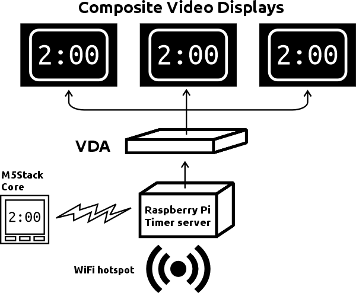

# 20x2 Chicago Clock server 

This is everything you need to set up a Raspberry Pi as a 20x2 clock server. As much stuff as possible is going to be scripted out, so that a basic Raspberry Pi can be turned into a [20x2 Chicago](http://www.20x2chi.org/) clock server. 

## What's going on here

This is an application to set up a Raspberry Pi server as a timer. Due to the unique requirements for the timer we use, this is the latest version of a long-running project to provide a usable timer with minimal points of failure.

Until recently the server was controlled remotely with, and displayed the time on, Arduino-based remote clients, but a catastrophic failure of the Arduino libraries used for controlling LCD displays has made that technology much less reliable. The Arduino remote is still viable, thanks to the [M5Stack](http://www.m5stack.com/) IoT platforms. 

So the current plan is: set up a Raspberry Pi server with a composite monitor (or rather multiple monitors connected using consumer-grade composite video distribution/amplifier products); use the Arduino remote to control the timer; and set up the screens on stage to be visible to the speakers.

## Installation

With the caveat that this documentation is still being worked out, here are the general steps.

* Build a stock Raspberry Pi image with the desktop.
* If you aren't immediately connecting a keyboard and monitor to the server for further setup, you should review the instructions on [setting up a headless Raspberry Pi](https://www.raspberrypi.com/documentation/computers/configuration.html#setting-up-a-headless-raspberry-pi) at the official site.
* Log into the RPi instance. Change the 'pi' password. (The script may think you haven't changed the password if you don't reboot after the password change. This warning can safely be ignored.)
* Clone this repository.
* Edit the [setup script](install-scripts/setup.sh) to add in appropriate values for SSID and PASSWD (the credentials for the hotspot).
* Run the setup script from the repository directory.
    * If the script fails, there should be a message as to what to investigate to fix any issues.
    * If the script completes, you may get a list of warnings to inform you about issues that you should investigate.
    * If there are no warnings, then you should be good to go. 

Note that by default the hotspot will be inactive, so that you can continue server setup before you start using the timer.

## Using the timer

Once the setup is complete, you may start up the timer using the hotspot control script. The command **hotspot on** will activate the services needed to run the WiFi hotspot, and then reboot the machine. Running **hotspot off** will put the configs into their original state, to allow you to get back into the server for admin. (Note that connecting to the server while it is a hotspot may involve you either connecting to the hotspot to ssh into the box, or attaching a monitor and keyboard to your RPi.)

The Python timer display script should automatically start up when the RPi server reboots. If your server is connected to a composite monitor you should see the timer window, showing the current time as stored on the local HTTP server.

If you need to connect to the server while the hotspot is active, hitting the Escape key will close the timer window and bring you back to the desktop.

The hotspot config allows for an Arduino admin client to connect to the RPi and control the timer via the HTTP server. The ESP32 boards manufactured by M5Stack will be supported because they provide a simple all-in-one hardware product that can be used for the control.

## Technologies used

This server is designed to run on a vanilla Raspberry Pi desktop install. The stuff that will be built and installed:
* [OpenResty](https://openresty.org/en/installation.html) (Nginx dev tool with Lua scripting, used for the API)
* [Redis](https://redis.io/docs/getting-started/installation/install-redis-on-linux/) (in-memory database store)
* [Tkinter](http://tkdocs.com/) (Python interface for Tk)
* [hostapd](https://w1.fi/hostapd/) (host AP daemon for creating wifi hotspot)
* [dnsmasq](https://wiki.archlinux.org/title/dnsmasq) (for DHCP)

## Directories

* [arduino/](arduino/) -- Arduino admin client code (TODO)
* [images/](images/) -- XBM files used to display the digits on the Tk canvas
* [install-scripts/](install-scripts/) -- Scripts used to set up the RPi server configuration for use
* [nginx/](nginx/) -- This is the Nginx config file that serves up the API using Redis
  
## License
Distributed under the MIT License. See `LICENSE.txt` for more information.

## Contact
James Allenspach

james.allenspach@gmail.com

Project home: https://github.com/manminusone/20x2-clock-7
